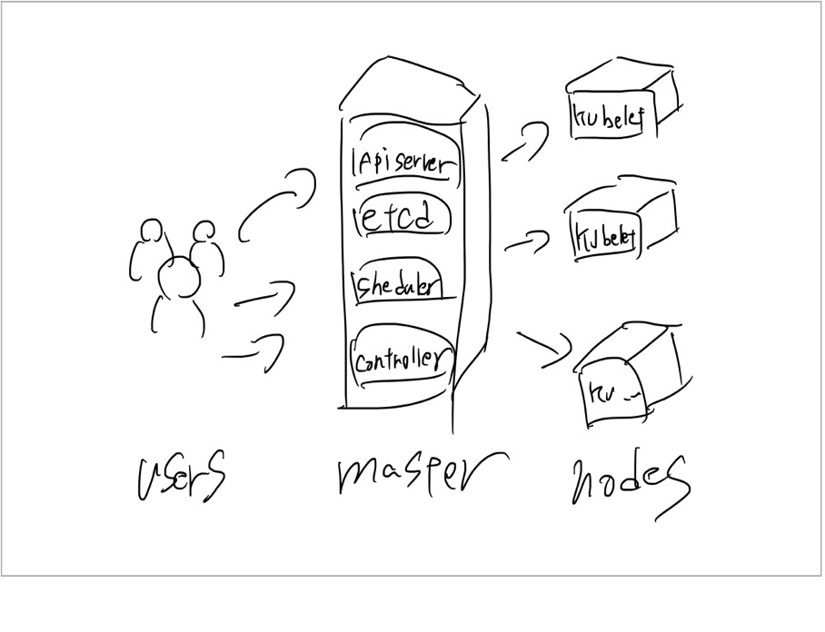
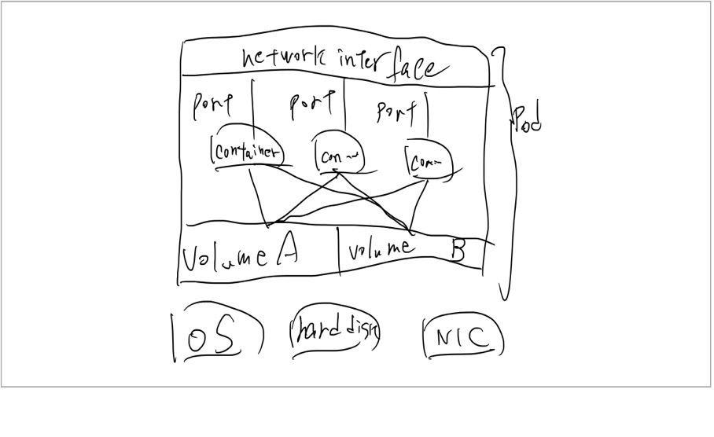

Kubarnetes Basics

Clusters, nodes, and pods,

all nodes running Kubelets.

The Kubenetes is a kubenetes agent & Self.

    

Pod
---

Pod is analogous to a VM, in a group of Containers sharing a network and Storage

    

Pod setting with a YAML file.